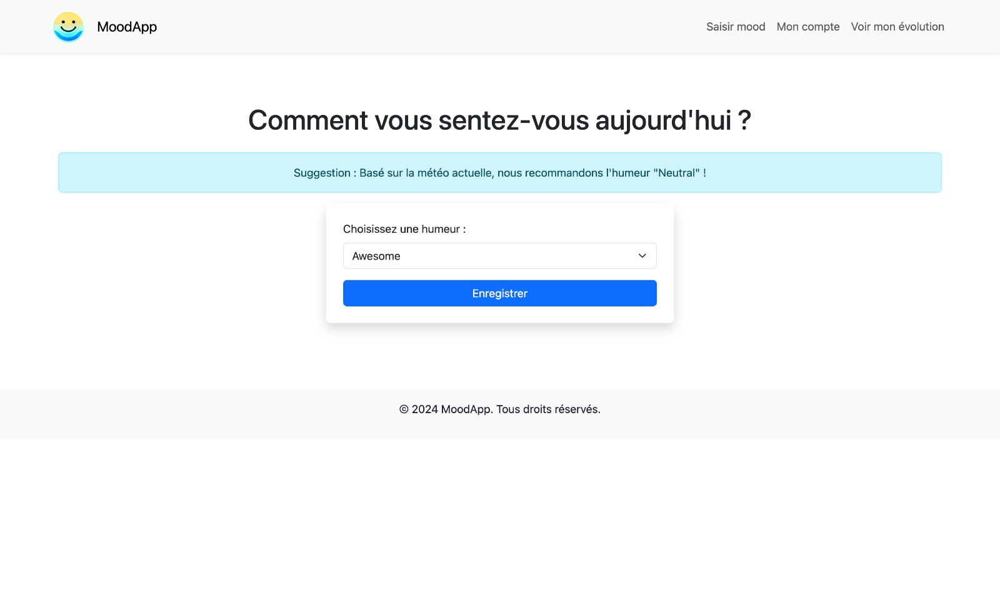
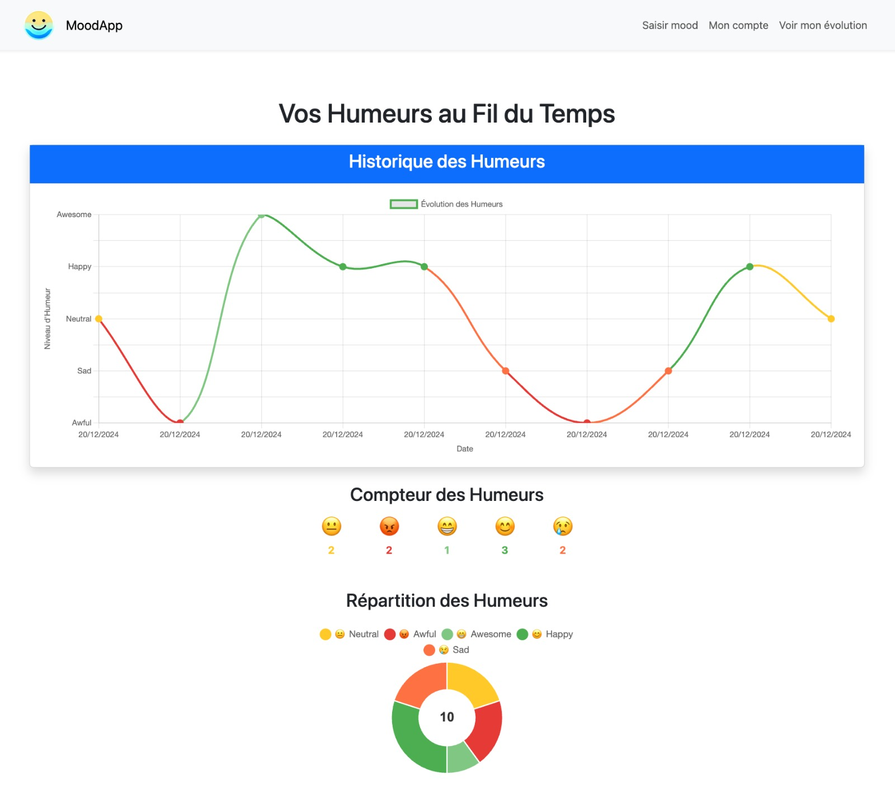

= ```MoodApp``` Documentation

== Neptune MIAGE organization members
Kevin SOARES, Ryad MESSAOUDI, Yassine BENABDELKADER, Romain THOMAS

== App purpose
Here's a quick description about the app purpose, the features available...

MoodApp is an app where you can enter your mood daily, follow precisely the evolution of your mood, get recommandations on your mood based on the day's weather, and more to come... 

== How to install and run project ?

=== Prerequisites
You need Git and Python (or Python3) downloaded on your computer.  

=== Install project 
Use Git to clone the project on your computer.

=== Run project
1. Open terminal  
2. Whether you have a Mac/Linux or a Windows, you should only need to run a script to get started.

See README.md on branch main for commands needeed to run the project.

[Access repository] https://github.com/Neptune-MIAGE/BackEnd

== Features description 

=== User's mood addition and visualization
An user can add his mood, going from "awful" to "awesome" (whenever and as much as he wants for now).

A chart is created with the user's moods, showing the evolution of the mood.

There are also smileys counters and a pie chart that show the number and repartition of the previous entered moods.

=== Mood suggestion depending on the wheather
The OpenMeteo API recovers the weather on the user, depending on his location (for now, the default location is Paris).

The user's mood is then suggested, according to the current weather (for example, a rainy weather will suggest a sad mood).

The user can follow or not the mood suggestion when he adds his mood.

The current weather is saved when adding a mood. This will be helpful for improving or creating future features.

=== Screenshots

==== See mood suggestion and add mood


==== See mood evolution and informations

